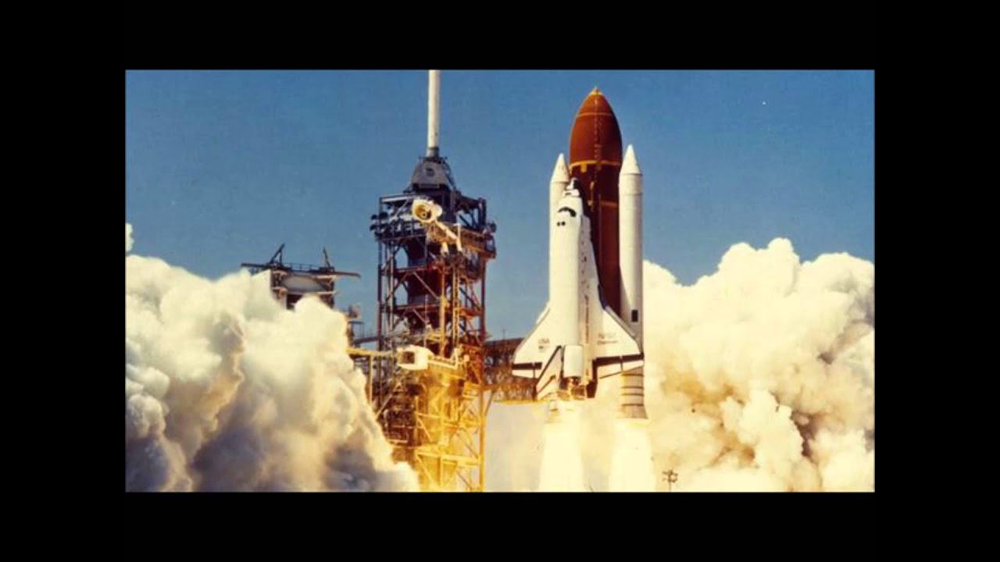

انگلیز دەڵێ "Normalisation of Deviance"

واتە ئاسایی بوونی لادان

بە وەرگێڕانێکی تر؛ شاڕێ بوونی لاڕێکان.

یان بە کوردیە عامەکەی؛ ‘فشەیە’

فشەیە. ئەو وشەیەی کورد لەوانەیە پێش دایە و بابە فێری بێ، ڕەگی زۆر لە موشکیلەکانی ئێمەیە.

بە مەبەستی گەشتن بۆ هەر شوێنێک، شاڕێیەک هەیە، ڕێیەکی سەرەکی هەیە، کە ڕاستترین ڕێیە بۆ گەشتن بە شوێنی مەبەست. بەڵام لەگەڵ هەر شاڕێیەکیش، لاڕێ هەن، کە پیاو ناگەیەننە شوێنی مەبەست و هەوڵەکانی ڕێبوار بەفیرۆ دەدەن.

هەموو جار کە دەستووری شوێنێک، کۆمەڵێک، ڕێکخراوێک، پڕۆژەیەک یاخود ئیشێک دادەڕێژرێ، ئەو دەستوورە دوای حیساب و کیتاب و ڕەچاو کردنی زۆر ورد دادەنرێ. بێگومان هەر قورساییەک لەسەر جێبەجێ کارانی هەبێ بە خۆڕایی نیە و بۆ سوود و قازانجی ئەوان و غەیری ئەوان و پڕۆژەکەیە. ئەم دەستوورە شاڕێیەکەیە.

بۆ نموونە، دەست شردن و پاک و خاوێنی. دەستوورێکی سەرەتایی شارستانی سەردەمە و هەر لە منداڵیەوە هەموومان فێر دەکرێین لە چەند کاتێکی دیاری کراو دەستمان پاک بشۆین.

ئەم دەستوورە بۆ سودی خودی خۆمان و چواردەورمانە. گەر نەیکەین کەس لێمان ناپرسێتەوە.

بەینی خۆمان بێ، زۆر جار نەمان کردووە.

کە زۆرجار نەمان کردووە، هیچ بووە؟ نا، هیچ نەبووە. ئەگەر شتێکیش بووبێ، ناڕاستەوخۆ بووە و نەمانتوانیووە ڕوودانی شتەکە ببەستینەوە بە نەشردنی دەستمانەوە.

جارێک دەست ناشۆین، هیچ نابێ. دووبارەی دەکەینەوە، دیسان هیچ نابێ. سێبارە و دەبارە و سەدبارەی دەکەینەوە، هەر هیچ نابینین. ئیتر بەرە بەرە دەست نەشردن دەبێتە کلتوورمان.

کێشە لێرەوە دەخولقێ، کە دەست نەشردن دەبێتە شاڕێ و دەستشۆری دەبێتە لاڕێ، کە دەست نەشردن دەبێتە کلتوور و نۆرم و دەست شردن دەبێتە شاز و نائاسایی.

وایە لەوانەیە دەست نەشردن زۆربەی زۆری جارەکان هیچ کێشەیەکی بەدوادا نەیە، بەڵام کێشە هەر دێ. کە هاتیش، نەخۆشی و ناخۆشی زۆری لێ دەکەوێتەوە.

ئەوەی کێشەکە ئالۆزتر دەکا ئەوەیە، ئەوانەی لاڕێ دەڕۆن خۆیان نابینن. لای ئەوانەوە ئەو لاڕێیە شاڕێیە و هەموو کەس وا دەڕوا و هیچ کێشە نیە و هەر کەس پرسیاریش ناکا ئایا ئەم ڕێیە ڕاستەکەیە یان هەڵەکەیە

هەڵە بوونی ڕێیەکە زۆر جار ئەو کاتانە دەردەکەوێ کە کەسێک لە دەرێی سیستەمەکەوە سەیری سیستەمەکە دەکا یان کەسێکی نوێ دێتە ناو سیستەمەکە.

بۆ نموونە، دەست نەشردن بۆ کەسێک بۆتە ئاسایی و نۆرمی ڕۆژانەی. ئەستەمە خۆی هەست بەخۆی بکات. بەڵام کاتێک لەگەڵ یەکێکی تر هەستان و دانیشتنی دەبێ، ئەوی تر دەیبینێ و ڕەخنەی لێ دەگرێ. کەسی دووەم لاڕێ بوونی کەسی یەکەم دەبینێ، بەڵام کەسی یەکەم هیچ کێشەیەک لەخۆیدا نابینێ..

“جا گەورەترین کارەسات ئەوەیە کەسی یەکەم (دەست نەشۆرەکە) لە وەڵامدا بڵێ “فشەیە!

فشەیە ئەو وشە زۆر زۆر خەتەرەیە کە شاڕێ بوونی لاڕێکەمان بۆ دەشەرعێنێ، بەردەوامی دەدا بە ڕۆشتن لەسەر ڕێی غەڵەت و دەرک نەکردن بە ڕێ ڕاستەکە

ئەمە هەر لەبواری دەست شردن و پاک و خاوێنی نا، بەڵکو زۆر لایەنی ژیانمانی تەنیوە. زۆر لەو ڕێیانەی لەسەریان دەڕۆین لاڕێن، بەڵام ئێمە بە شاڕێیان دەزانین و قەت ناوەستین پرسیار بکەین ئایا ئەوەی لەسەری دەڕۆین ڕێ تەواوەکەیە یان ناتەواو.

ناڵچیەک لە کاتی داکوتانی بزماری ناڵێک، گەندەڵی کرد و وتی “فشەیە. چیە قابیلە؟! هەر ناڵەی بە چەند بزمارێک بەندە. بە یەک بزماری ناجێ ناڵەکە شل نابێ.”.

ناڵەکە خزا، ئەسپەکە کەوت، بەهۆی ئەمەوە سوارەکەی سەری کەوت. لە ئەنجامدا جەنگەکەیان دۆڕاند. دەرەنجام وڵاتێک داگیرکرا و ماڵی هەزارەها کەس تاڵان و کاول کرا.

دکتۆرێک نەخۆشێک دەپشکنێ. بەکتریا و میکرۆبی ئەو نەخۆشە دێنە سەر دەست و پلی. کە دەڕوا بۆ فەحسی نەخۆشێکی تر، هەر بەخەیاڵیشیدا نایە دەستی بشوا چونکە پێشتر هەموو وتوویانە فشەیە و دەست نەشردن لەنێوان پشکنینی نەخۆشەکان بۆتە شاڕێ. بەم شێوەیە هەرچی بەکتریا و میکرۆبی سەر نەخۆشی یەکەمە دەیگوازێتەوە بۆ نەخۆشی دووەم و داماوە خۆی نەخۆشیەکی لێ دەرد بوو، کاکی دکتۆر بۆی دەکاتە دوو نەخۆشی.

پیشەسازی فرین پیشەسازیەکی زۆر وردە. بۆ هەموو شتێک چێک لیست هەیە. پێش فرین کۆمەڵێک چێک لیست هەیە لەسەر لەباری فرۆکەکە و جەوەکە. پێش نیشتنەوە کۆمەڵێک چێک لیستی تر هەیە. دوای نیشتنەوە هی تر هەیە. وەلحاڵ هیچ فرۆکەیەک هەنگاوێک ناڕوا بێ چێک لیست. هەر ئەمەشە وای کردووە فڕین بە فڕۆکە یەکێک بێ لە سەلامەتترین هۆکارەکانی گواستنەوە.

لە ساڵی ٢٠١٥ فرۆکەیەکی تایبەت بەربۆوە و هەموو سەرنشینەکانی گیانیان لەدەست دا. بۆ ئەمە ڕووی دا؟ چونکە ئەو جارە بە وردی چێکی تەیارەکەیان نەکردبوو و چێک لیستیان پڕ نەکردبۆوە.

دەرکەوت نەک هەر ئەو جارە، بەڵکو زۆر جاری تریش کاکی فڕۆکەوان و جەماعەتەکەی چێکی فڕۆکەکەیان نەکردووە. جارێک دووان پشت گوێیان خستووە و بەخۆیان وتووە “دەی خوا کەریمە آشاللە هیچ نابێ. پێشتر هەزار جار پڕمان کردۆتەوە و هەر موشکیلەی نەبووە، بەم جارەش هیچ نابێ.”

شت بوو، هەمووشمان دەزانین هەندێ شت هەیە یەکجار دەبێ. کە قەوما قەوما. گەڕانەوە نیە.

سوار سەیارە دەبی و تاقەتت نیە خۆت ببەستیەوە. دەڵێی دەی کوڕە فشەیە. هەزار جار سوار بووم هیچ نەبووە ئەم جارەش هیچ نابێ. بیززەبت هیچیش نابێ ئەو جارە، بەڵام دووبارەی دەکەیەوە تا وای لێدێ دەگمەن خۆت دەبەستیەوە و خۆنەبستنەوە دەبێتە شاڕێت.

لەکاتی شۆفێری نامەیەکت بۆ دێ. دەڵێی دەی هیچ نابێ و وەڵام دەدەیەوە تا وای لێدێ نامە وەڵام دانەوە لەکاتی سایەقی زۆر زۆۆۆر شتێکی ئاسایی دەبێ بەلاتەوە.

جارێکیان بە تەکسی لە هەولێرەوە ڕۆشتمەوە سلێمانی. سایەقەیە نەک بە مۆبایلێک، بە دوان وەڵامی نامەی دەدایەوە و خەریکی چات بوو! هەردوو مۆبایلەکەی لەسەر سووکانی سەیارەکە دانابوو! شەو بوو، ڕێی خاریجی بوو، ئێمەی سەرنشینیش ڕەنگمان پەڕی بوو.

زۆری پێ نەچوو ئەوەی دەستی ڕاستم ووتی برا گیان ئێستا کەی وەختی چاتە؟!! وەڵا بووە مشتومڕ. کابرای سایەق لە گەرمەی مشتومڕەکە خاو خاوی کردەوە ووتم ئەوە ئێستا ڕای دەگرێ تا بێ لەوەی تەنیشتم دا! یانی هێشتا کاکی سایەق خۆی پێ ڕاست بوو و خۆی بە قوربانی دەزانی! ئەمە بۆ؟ چونکە وەڵام دانەوە لەکاتی سایەقی بۆتە شاڕێی. ئەوەندە لای ئاسایی بووە، پێی غەدر و ناهەقیە پێی بووترێ کاکە ئەمە غەڵەتە. جا هەر واشی دەگوت، دەیگوت من چەندین جاری تر چاتیشم کردووە و هیچیش نەبووە!

قوتابێ دەڵێ بە نەخوێندنی ئەم دەرسەش هیچ نابێ، تا نەخوێندن دەبێتە نۆرم و خووی ڕۆژانە و شاڕێی.

دکتۆر دەڵێ بەم دەست نەشردنەش هیچ نابێ، بەم نەپشکنینەش هیچ نابێ، تا دەست نەشردن و نەپشکنین دەبێتە شاڕێی.

کاکی ئەندازیار دەڵێ بە نەکردنی ئەم احتیاتەش هیچ نابێ، بە دانەنانی ئەم ئەرزیەش هیچ نابێ، تا وای لێدێ ئەو احتیاتە هەر لە یاد دەچێتەوە. پاشان ڕۆژێک یەکێک لەو پڕۆژانە شۆرتێک دەکا یا بروسکێک لێی دەدا و دەبێتە کەوتنەوەی ئاگرێکی گەورە و زیانێکی گیانی و ماددی زۆر.

کاکی شۆفێر دەڵێ بە خێرا ڕۆشتنم هیچ نابێ، تا دەبێتە شۆفێرێکی خێرا و ڕۆژێک کارەساتێک لەسەر دەستی ڕوودەدا.

کاکی وەستا دەڵێ بە نەبەستنی ئەم شیشەش هیچ نابێ، تا هیچ شیشێک نابەسترێ و دوای ٢٠ ساڵ بوومەلەرزەیەک لەو شوێنە دەدا و بیناکە دێتە خوارێ و کارەساتی دڵتەزێنی لێ دەکەوێتەوە. ئەگەر خوا نەبێ، کێ هەیە یەخەی ئەم وەستایە بگرێتەوە؟

خانمی پارێزەر (محامی) دەڵێ بەم شەهادە تەزویر و درۆینەش هیچ نابێ، تا وڵات پڕ دەبێ لە شەهادەداری بێ توانا و وڵات لە پێشکەوتن دەوەستێ و کەس متمانەی بە شەهادە نامێنێ.

کاکی بەڕێوەبەر دەڵێ بەم سووکە واستەیەش هیچ نابێ، تا وای ڵێدێ واستە و سەرەبڕی زۆر ئاسایی دەبێتەوە و کەس متمانەی بە پۆست و پلە و ئیشی حوکمەت نامێنێ.

بە درۆیەکی بچووک هیچ نابێ، درۆ دوای درۆ لە کۆتاییدا دەبینە کەسێکی درۆزن و درۆ زۆر لامان ئاسایی دەبێ.

لە کۆتاییشدا، الهام بەخشی ئەم پۆستەم کۆرۆنا بوو. تکایە مەڵێن دەست شردن فشەیە، پشمین و کۆکەکانتان جوان داپۆشن. چوونەدەرەوەکانتان تا دەکرێ کەم کەنەوە. مەڵێن فشەیە. ئەرکێکی ئەخلاقی و انسانی هەموومانە خۆمان بپارێزین. چونکە ئەم بابەتە هەر خۆمانی تێدا نین. تووشبوونی تۆ واتە تووشبوونی هەموو دەوروبەرەکەت. تکایە پەیڕەوی دەستوورەکانی خۆپارێزی بکەن لەم نەخۆشیە.

ئایا ئەو ڕێیەی لەسەری دەڕۆی، شاڕێیە و لەسەر ڕێی ڕاستی؟ یان لاتداوە و لاڕێی؟

لەگەڵ هیوای سەلامەتی و هاوکاری هەموو لایەک.